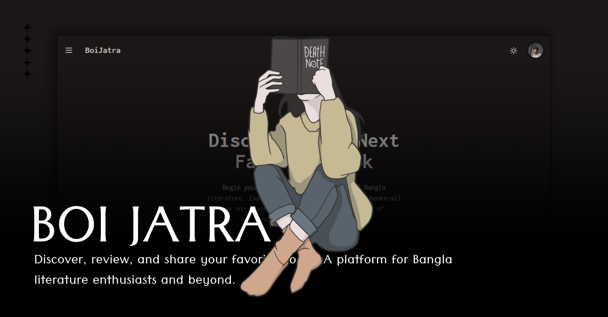

<!-- Banner Placeholder -->
<div align="center">
  <!-- Add your banner image here -->
  
  <br/>
  <h1>BoiJatra - Book Sharing Platform</h1>
  <p>Discover, review, and share your favorite books. A platform for Bangla literature enthusiasts and beyond.</p>
</div>

## ✨ Key Features

- ✅ **User Authentication**: Secure login/logout with Google OAuth via Supabase.
- 🎨 **Dynamic Theming**: Switch between light and dark themes.
- ✍️ **Post Creation**:
  - Share book reviews with ratings.
  - List books for sale with price and condition.
- 🖼️ **Image Uploads**: Upload book cover images to Supabase Storage.
- 🔍 **Post Discovery**: Browse all user-submitted posts.
- 📊 **User Dashboard**: View personal stats (total likes, views, posts) and manage created posts.
- 📱 **Responsive Design**: Accessible on various devices.

## 🛠️ Tech Stack

- **Frontend**:
  - [React](https://reactjs.org/) ⚛️
  - [Vite](https://vitejs.dev/) ⚡
  - [React Router](https://reactrouter.com/) 🔄
  - [Tailwind CSS](https://tailwindcss.com/) 🌬️
  - [DaisyUI](https://daisyui.com/) 🌼
  - [Lucide Icons](https://lucide.dev/) ✨
- **Backend & Database**:
  - [Supabase](https://supabase.io/) (PostgreSQL, Authentication, Storage) 
- **Linting**:
  - [ESLint](https://eslint.org/) 🧹

## 📁 Project Structure

```
.
├── public/                  # Static assets
├── src/
│   ├── assets/              # Image assets, etc.
│   ├── components/          # Reusable UI components
│   │   ├── ActionCard.jsx
│   │   ├── HomePostCard.jsx
│   │   ├── LoginCard.jsx
│   │   ├── Navbar.jsx
│   │   ├── PostListCard.jsx
│   │   └── Stat.jsx
│   ├── pages/               # Page-level components
│   │   ├── AddPost.jsx
│   │   ├── Auth.jsx
│   │   ├── Deshboard.jsx
│   │   ├── Home.jsx
│   │   ├── NotFound.jsx
│   │   └── Post.jsx
│   ├── provider/            # React Context providers
│   │   ├── ThemeProvider.jsx
│   │   └── UserProvider.jsx
│   ├── utils/               # Utility functions
│   │   └── supabase-client.js
│   ├── App.jsx              # Main application component with routing
│   ├── index.css            # Global styles and Tailwind imports
│   └── main.jsx             # Entry point of the React application
├── .env                     # Environment variables (Supabase keys)
├── .gitignore               # Files and folders to ignore in Git
├── eslint.config.js         # ESLint configuration
├── index.html               # Main HTML file
├── package.json             # Project dependencies and scripts
├── README.md                # This file
└── vite.config.js           # Vite configuration
```

## 🚀 Getting Started

### ✅ Prerequisites

- Node.js (v18 or higher recommended) 🟢
- npm or yarn 📦

### ⚙️ Installation

1.  **Clone the repository:**

    ```bash
    git clone <your-repository-url>
    cd boipoka
    ```

2.  **Install dependencies:**

    ```bash
    npm install
    # or
    yarn install
    ```

3.  **Set up environment variables:**
    Create a `.env` file in the root directory and add your Supabase URL and Anon Key:

    ```env
    VITE_SUPABASE_URL=your_supabase_url
    VITE_SUPABASE_ANON_KEY=your_supabase_anon_key
    ```

    You can find these in your Supabase project settings.

4.  **Run the development server:** ▶️
    ```bash
    npm run dev
    # or
    yarn dev
    ```
    The application will be available at `http://localhost:5173` (or another port if 5173 is busy).

## 📜 Available Scripts

In the project directory, you can run:

- `npm run dev` 💻: Runs the app in development mode.
- `npm run build` 📦: Builds the app for production.
- `npm run lint` 🧐: Lints the codebase using ESLint.
- `npm run preview` 👁️: Serves the production build locally.

## ☁️ Supabase Setup

This project uses Supabase for its backend services. Ensure you have:

1.  A Supabase project created.
2.  Enabled Google as an OAuth provider in your Supabase project's authentication settings.
3.  A storage bucket named `bookimages` with appropriate access policies (e.g., public read access for images, and authenticated users can upload).
4.  A table named `booktable` with the following (or similar) schema:

    - `id` (uuid, primary key)
    - `created_at` (timestamp with time zone, default now())
    - `image_url` (text)
    - `title` (text)
    - `subtitle` (text, nullable)
    - `description` (text)
    - `price` (numeric, default 0)
    - `stars` (integer, default 0)
    - `user_id` (uuid, foreign key to `auth.users.id`)
    - `book_condition` (text, nullable)
    - `ispost` (boolean, default true)
    - `book_author` (text, nullable)
    - `genre` (text, nullable)
    - `views` (integer, default 0)
    - `likes` (integer, default 0)
    - `comments_count` (integer, default 0)
    - `reviews_count` (integer, default 0)
    - `post_author_name` (text, nullable)

    Make sure to set up Row Level Security (RLS) policies on your `booktable` to control data access appropriately. For example:

    - Allow public read access.
    - Allow authenticated users to insert their own posts.
    - Allow users to update/delete their own posts.

---

<div align="center">
  <p>Happy Coding! 🎉</p>
</div>
